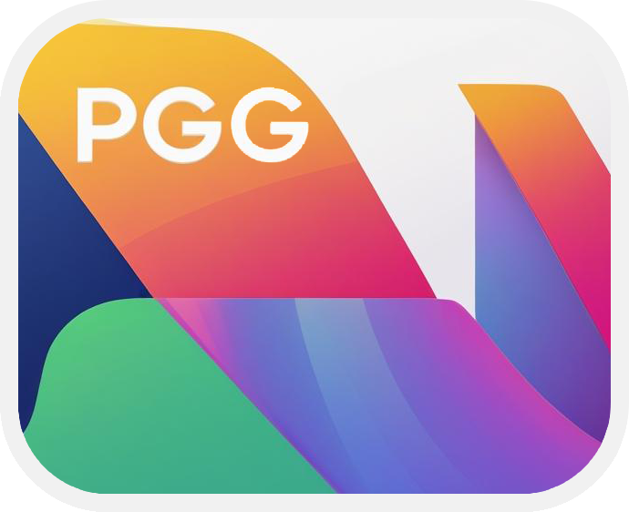
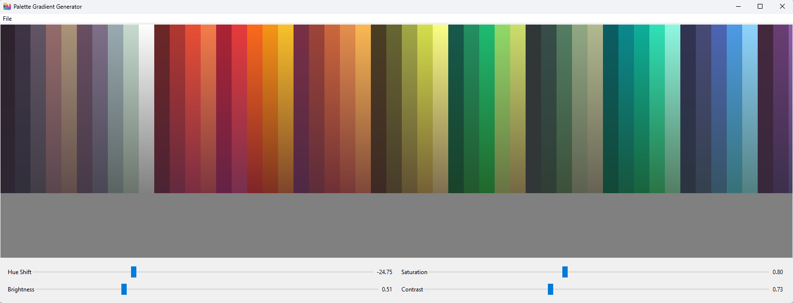

# Palette Gradient Generator (PGG)

<table>
  <tr>
    <td>
      
    </td>
    <td>
      <strong>Palette Gradient Generator (PGG)</strong> is a simple and powerful desktop tool for artists and 3D designers that generates vertical gradient palettes based on a row of base colors. It's especially useful for creating rich, varied color swatches to simulate depth and light variation in texture painting or stylized shading workflows.
    </td>
  </tr>
</table>

## ✨ Features

- Load PNG images with base colors (horizontal row).
- Generate vertical gradients for each color block.
- Real-time adjustments using intuitive sliders:
  - **Hue Shift**: Shifts the color tone.
  - **Saturation**: Boost or reduce color intensity.
  - **Brightness**: Adjust lightness.
  - **Contrast**: Enhance or flatten tonal range.
- Zoom and pan the preview image.
- Export the result as a PNG file.
- Lightweight and standalone – no installation required (once built).

## 🖌 Preview



## 🖼 Use Case

This tool is ideal for creating stylized gradient palettes in texture creation for 3D modeling, pixel art, or concept art. You can easily derive shading variations from a set of flat base tones.

## 🎨 Recommended Resources

A great source of base palettes is [Lospec Palette List](https://lospec.com/palette-list).  
You can download any palette as a 32x1 PNG image using the **"Download → Image (32x)"** option on each palette's page.

These images are fully compatible with the app and can be open directly into the interface to generate new gradients.


## 📦 Installation

To run the app, you'll need Python 3.8+ and the following dependencies:

```bash
pip install pillow numpy
```

Then simply run:

```bash
python pgg.py
```

## 🔧 Build Executable (Optional)

If you want to create a standalone executable (for Windows):

1. Install PyInstaller:

```bash
pip install pyinstaller
```

2. Build the app with an icon:

```bash
pyinstaller --onefile --windowed --icon=icon.ico pgg.py
```

The `.exe` file will be generated in the `dist/` folder.

## 📁 Project Structure

```
├── pgg.py               # Main application file
├── icon.ico             # App icon (used for the .exe)
├── README.md            # Project documentation
└── sample_palettes/     # (Optional) Example base palettes
```

## 📄 License

This project is released under the MIT License. See [LICENSE](LICENSE) for more details.

## 🤝 Contributions

Contributions, ideas, and suggestions are welcome! Feel free to open an issue or submit a pull request.